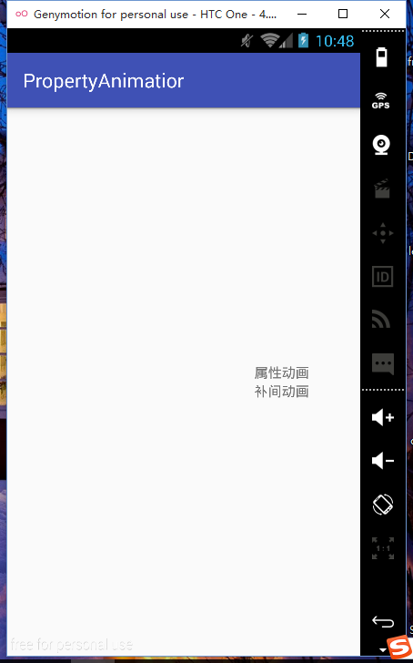
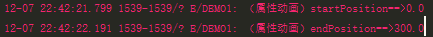
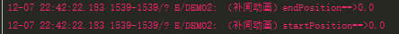

#区别
属性动画和补间动画最大的区别就是，补间动画只是看起来改变了实际上属性并没有改变，但是属性动画是实际改变了view的属性值。比如说：把一个按钮从（0,0）的位置移动到了（100,100）的位置，如果使用补间动画移动之后按钮看起来跑到了（100,100）的位置，其实还是在（0,0）的位置。如果使用属性动画，那么按钮就确实移动到了（100,100）的位置，可以看一下下面的demo。
```java
//补间动画，把view从当前位置移动到300px处，log打印动画未开始和动画结束之后的坐标
TranslateAnimation translateAnimation=new TranslateAnimation(image2.getTranslationX(),300,image2.getTranslationY(),image2.getTranslationY());

//属性动画 效果和补间动画一样
        ObjectAnimator objectAnimator = ObjectAnimator.ofFloat(view,"translationX",view.getTranslationX(),300);

```

然后看一下log
`属性动画的log`<br/>


`补间动画的log`<br/>


可以看到属性动画的X值变化了，但是补间动画的一直是0，所以可以证明上面的结论：补间动画知识看起来改变了，但是他的实际属性并没有改变；属性动画实际上改变了view的属性值。

#ValueAnimator
看一下效果图：


看一下示例代码：
```java
	//要在400秒从0变化到1
 ValueAnimator valueAnimator=ValueAnimator.ofFloat(0f,1f);
 valueAnimator.setDuration(1000);
 		//每一次动画刷新都会调用这个方法
        valueAnimator.addUpdateListener(new ValueAnimator.AnimatorUpdateListener() {
            	@Override
            	public void onAnimationUpdate(ValueAnimator animation) {
            	//获取到计算出来的值
              	float value= (float) animation.getAnimatedValue();
              	view给自己的属性设置这个值
                text1.setAlpha(value);
            }
        });
```
ValueAnimator是ObjectAnimator的父类，ValueAnimator创建对象一般使用ofXXX()方法：
	

一般会接受两个参数 例如上面的例子中接受两个参数0和1，valueAnimator就会根据你输入的Duration和0,1折两个值计算出每一时刻的属性值，然后我们可以到onAnimationUpdate监听器里面得到这个值然，后view赋值给自己的属性。（ValueAnimator也可以接收到多个参数，第一个参数是初始值，最后一个是结束值，中间的都是中间的值。。。。。。。）


**总结一下：valueAnimator就是一个计算器，你给他初始值，中间值，和结束值，然后他会通过监听器把当前时刻计算得到的值返回给外界，view就可以拿到这个值进行操作（设置X，Y坐标，透明都可以）。**


可以看到上面还有一个ofObject方法，这个怎么用？
先看一下效果图：


```json
final ValueAnimator valueAnimator=ValueAnimator.ofObject(new TypeEvaluator<Point>() {
            //计算当前时刻point的值，fraction参数是动画已经执行了了百分之多少
            @Override
            public Point evaluate(float fraction, Point startValue, Point endValue) {
                int x= (int) (startValue.x+fraction*(startValue.x-endValue.x));
                int y= (int) (startValue.y+fraction*(startValue.y-endValue.y));

                return new Point(x,y);
            }
            //new两个point，起点是0,0,终点是300,300
        },new Point(0,0),new Point(300,300));

        //使用计算出的point的值更新view属性
    valueAnimator.addUpdateListener(new ValueAnimator.AnimatorUpdateListener() {
    @Override
    public void onAnimationUpdate(ValueAnimator animation) {
        Point point= (Point) animation.getAnimatedValue();
        text1.setTranslationX(point.x);
        text1.setTranslationY(point.y);
    }
});
```
看到上面有一个TypeEvaluator对象，主要覆写了他的evaluate函数，我们在上面的上面的例子用得到的` float value= (float) animation.getAnimatedValue();`得到的值就是evaluate计算出来的。也就是说这个函数是用来计算当前时刻的值（比如说我们想计算0到1，那么这个函数计算的是当前时刻这个值应该是多少，比如已经到了0.65或者已经到1了）。
上面evaluate计算的时候使用了一个fraction参数，这个参数代表动画的完成程度0代表未开始，1代表已完成那么这个值是哪来的呢？这个是插值器计算的，Android内部有许多内置的插值器，例如：<br/>AccelerateInterpolator（加速）
AccelerateDecelerateInterpolator（先加速，后减速）等等。。

总结：
**1.ofObject的使用方法就是**

- 1.覆写TypeEvaluator的evaluate，这个方法用来计算当前Point应该得到的值。
- 2.onAnimationUpdate得到值然后赋给view对象（和最初的使用方法一样）。

**2.属性动画计算流程是这样**
```flow
st=>start: Animator.start
e=>end: 结束
op1=>operation: Interpolator计算出fraction
op2=>operation: evaluate通过fraction计算出当前值
op3=>operation:  animation.getAnimatedValue();获取到上面计算到的值然后交个View处理
st->op1->op2->op3->e
```
##ObinectAnimator
ObinectAnimator是ValueAnimator的子类，使用方法十分简单。
效果图：


```java
        ObjectAnimator animator=ObjectAnimator.ofFloat(view,"alpha",0f,1f);
```
ObjectAnimator.ofFloat
- 1.第一个参数是view
- 2.第二个参数是要改变的属性的名称（这个名称必须有set方法）
- 3.后面的参数和ValueAnimator是一样的（要改变的值的范围）。

**ObjectAnimator会自动计算值然后通过view.setXXX方法设置给view**

注意：如果这样调用
`ObjectAnimator animator=ObjectAnimator.ofFloat(view,"alpha",1f);`
即属性参数后面只给出一个值参数（上面这句代码只给出了1f），那么这个值默认为结束值，开始值会通过ObjectAnimator调用getXXX方法获得，所以这样写的时候想要改变的属性必须同时有get和set方法。

setTarget方法也可以设置view对象，例如animator.setTerget(view)。


##AnimatorSet
属性动画也可以像补间动画一样多个动[](http://)画同时播放
```java
 ObjectAnimator alpha = ObjectAnimator.ofFloat(text1, "alpha", 0f, 1f);
        ObjectAnimator tranX = ObjectAnimator.ofFloat(text1, "translationX", (text1.getTranslationX()), 200f);
        ObjectAnimator tranY = ObjectAnimator.ofFloat(text1, "translationY", (text1.getTranslationY()), 200f);
AnimatorSet set = new AnimatorSet();
//设置播放顺序先播放tranX然后同时播放tranY和alpha
set.play(alpha).with(tranY).after(tranX);
set.start();
```

上面设置了三个ObjectAnimator，然后创建AnimatorSet对象，最后通过set.play(alpha).with(tranY).after(tranX);设置播放顺序你（感觉这个读起来和英语语法的顺序一样）
最后start。

**属性动画也可以使用XML来定义，但是使用xml情况不多就不介绍了**


想了解更多可以参考以下博客：
	[郭霖_属性动画](http://blog.csdn.net/guolin_blog/article/details/43536355)
比较好的属性动画：
[炸裂效果](https://github.com/tyrantgit/ExplosionField)
